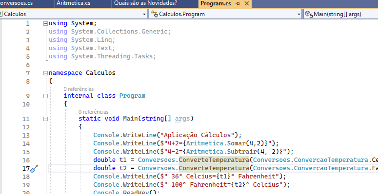

# Cálculos :1234:
 Aplicação C# para realizar diversos tipo de cálculos

Aplicação desenvolvida no âmbito da ação de formação ** Introdução do Git e GitHub **

## Operações suportadas
Neste momento esta aplicação implenta as seguintes operações:

 - Soma
 - Subtração
 - Conversão de temperaturas e distâncias

## Tecnologias utilizadas
   - Visual Studio 
   - Git
   - GitHub Desktop
   - Plataforma GitHub

##Site Oficial
[www.ferramentaseducativas.com]

